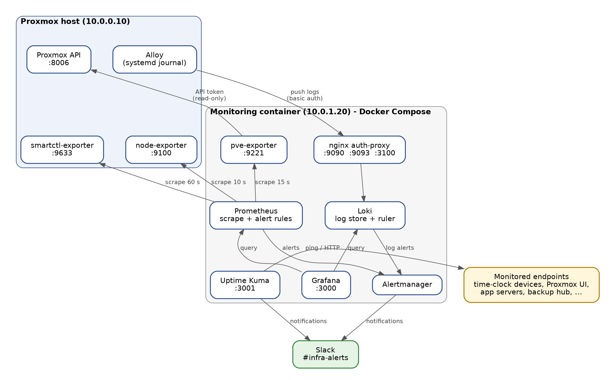

# Production Monitoring Stack: Metrics, Logs, Alerting and Availability

**A self-hosted observability stack for a production Proxmox server, built with Prometheus, Loki, Grafana, Alertmanager and Uptime Kuma. It watches disk health, resource pressure, logs and service availability, and sends alerts to Slack.**


> **About this document:** This is a sanitized portfolio version of an internal system document. Company name, IP addresses, hostnames, VM/CT names and IDs, file paths, and channel names are replaced with dummy values. No secrets were ever included. The design, alert rules, and procedures reflect the real project.

---

## Contents

1. [Summary](#summary)
2. [Why I Built It](#why-i-built-it)
3. [What It Monitors](#what-it-monitors)
4. [Architecture](#architecture)
5. [Components](#components)
6. [Alerting](#alerting)
7. [Availability Monitoring](#availability-monitoring)
8. [Security Design](#security-design)
9. [Operations](#operations)
10. [Backup and Recovery](#backup-and-recovery)
11. [Known Limitations](#known-limitations)
12. [Skills Demonstrated](#skills-demonstrated)
13. [Related Projects](#related-projects)

---

## Summary

| | |
|---|---|
| **Goal** | Detect failing disks, resource bottlenecks, and service outages early, before users notice. |
| **Scope** | One Proxmox host (single node) and its 12 guests (3 VMs, 9 containers). |
| **Stack** | Prometheus, Alertmanager, Loki, Alloy, Grafana, Uptime Kuma, nginx, and three exporters. |
| **Alerts** | **19 metric alerts** and **5 log alerts**, each marked *critical* or *warning*, delivered to Slack. |
| **Availability** | 22 ping/HTTP checks in 4 groups. |
| **Deployment** | All server components run as Docker containers in **one Compose project** inside a dedicated Proxmox container, separate from production workloads. |
| **Retention** | 30 days for metrics and logs. |

> **Note:** Guest counts differ between my three case studies because the environment changed over time (guests were added and decommissioned between projects).

---

## Why I Built It

The stack was deployed right after a [live HDD → SSD storage migration](https://github.com/your-username/proxmox-hdd-to-ssd-migration) of the same server. That project started with a failing disk and a heavily I/O-bound system, so the goal here was to **catch disk failure and I/O bottlenecks earlier next time**.

It runs in its own container, so it is independent of the production workloads. At the post-migration audit, all of its containers had been running continuously for more than 11 days.

---

## What It Monitors

| Area | Examples |
|---|---|
| **Proxmox host** | CPU, memory, filesystems, CPU and SSD temperatures, SMART health, SSD wear, reallocated sectors, media errors |
| **Guests (VMs and containers)** | Running state, memory use, container root-disk use, storage pool usage |
| **Host logs** | Web UI and SSH login failures, kernel disk I/O errors, out-of-memory kills, RAID controller warnings |
| **Availability** | Time-clock devices, Proxmox web UI, core application servers, backup hub and mirror, internal tools, and the monitoring stack itself |

**Not covered (by design):** OS and application metrics *inside* guests (no agent installed), guest logs (only the host journal is collected), and backup job results (tracked through backup logs, not alert rules).

---

## Architecture



**How data flows**

| Flow | Path |
|---|---|
| **Metrics** | Prometheus scrapes node-exporter (every 10 s), smartctl-exporter (60 s), and pve-exporter (15 s). pve-exporter reads the Proxmox API with a **read-only** token. |
| **Logs** | Alloy reads the host's systemd journal and pushes it to Loki through the nginx auth-proxy (basic auth). |
| **Alerts** | Prometheus evaluates metric rules every 10 s. The Loki ruler evaluates log rules. Both send alerts to Alertmanager, which groups them and posts to Slack. |
| **Availability** | Uptime Kuma runs ping/HTTP checks and notifies Slack on state changes. |
| **Dashboards** | Grafana queries Prometheus and Loki over the internal Docker network. |

---

## Components

### Server side (monitoring container)

The container has 2 GiB RAM and a 30 GB disk. Everything lives in one directory and one Compose file.

| Service | Role |
|---|---|
| **Prometheus** | Scrapes metrics, stores them, evaluates alert rules |
| **Alertmanager** | Groups alerts and sends them to Slack |
| **Loki** | Stores logs and evaluates log-based alert rules |
| **Grafana** | Dashboards and ad-hoc exploration |
| **Uptime Kuma** | Ping/HTTP availability checks |
| **nginx auth-proxy** | Basic-auth gateway in front of Prometheus, Alertmanager, and Loki |
| **pve-exporter** | Turns Proxmox API data (guests, storage) into metrics |

### Agents on the Proxmox host

| Agent | Role |
|---|---|
| **node-exporter** | Host OS metrics (plus textfile collectors for apt, sensors, NVMe, SMART) |
| **smartctl-exporter** | SMART disk metrics for both SSDs |
| **Alloy** | Ships the host journal to Loki |

### Data and retention

| Data | Retention | Size at baseline |
|---|---|---|
| Metrics (Prometheus) | 30 days | 672 MB |
| Logs (Loki) | 30 days (compactor retention on) | 33 MB |
| Dashboards (Grafana) | Persistent | 304 MB |
| Monitors and history (Uptime Kuma) | Persistent | 38 MB |
| Silences and notification log (Alertmanager) | Persistent | < 1 MB |

### Versions

Prometheus v3.14.0 · Alertmanager v0.34.1 · Grafana 13.2.2 · Loki 3.7.8 · Uptime Kuma 2.5.5 · pve-exporter 3.10.0 · nginx 1.30.5 · Proxmox VE 9.2.2

---

## Alerting

### Severity model

| Severity | Meaning | Expected response |
|---|---|---|
| **critical** | Service impact or risk of data loss | Immediate attention |
| **warning** | Degradation or an early indicator | Review during working hours |

### Notification behavior

Alerts are grouped by alert name and instance. Alertmanager waits 10 s before the first notification, sends updates every 30 s, repeats unresolved alerts every 4 hours, and posts both *firing* and *resolved* messages to a single Slack channel.

### Metric alerts (19)

| Group | Alert | Fires when | For | Severity |
|---|---|---|---|---|
| infra | InstanceDown | A scrape target is down | 30 s | critical |
| infra | DiskAlmostFull | A host filesystem has < 15% free | 10 m | warning |
| infra | SmartFailing | SMART overall health reports failure | 1 m | critical |
| infra | HighMemory | Host memory use > 90% | 10 m | warning |
| disks | SSDTemperatureHigh | SSD temperature > 55 °C | 5 m | warning |
| disks | SSDWearHigh | SSD wear indicator < 20 | 10 m | warning |
| disks | SSDReallocatedSectors | Reallocated sectors > 0 | 1 m | warning |
| disks-extra | SSDNewMediaErrors | Media/error counters increase within 1 h | 0 | warning |
| proxmox | GuestNotRunning | A VM or container is not running | 2 m | critical |
| proxmox | StorageAlmostFull | Proxmox storage usage > 85% | 10 m | warning |
| guests | GuestMemoryHigh | Guest memory > 95% of allocation | 15 m | warning |
| guests | GuestDiskHigh | Container root filesystem > 85% | 15 m | warning |
| cpu-temperature | CPUTemperatureHigh | Hottest CPU sensor > 80 °C | 5 m | warning |
| cpu-temperature | CPUTemperatureCritical | Hottest CPU sensor > 90 °C | 2 m | critical |
| resources | HighCPUUsage | Host CPU > 80% (5-min average) | 10 m | warning |
| resources | CPUUsageCritical | Host CPU > 95% | 5 m | critical |
| resources | MemoryCritical | Host memory > 95% | 5 m | critical |
| resources | SSDTemperatureCritical | SSD temperature > 65 °C | 2 m | critical |
| resources | DiskSpaceCritical | A host filesystem has < 5% free | 5 m | critical |

### Log alerts (5)

All log rules fire immediately and look only at the host's journal.

| Alert | Fires when | Severity |
|---|---|---|
| PVELoginFailures | 5 or more Proxmox authentication failures in 5 min | warning |
| SSHLoginFailures | 10 or more failed SSH passwords in 5 min | warning |
| DiskIOError | Any kernel disk I/O error in 5 min | critical |
| OOMKill | Any out-of-memory kill in 10 min | critical |
| RaidControllerWarning | RAID controller log lines with "fail", "offline", or "degraded" in 10 min | warning |

**Design choice:** Every alert has a documented "typical action" in the runbook (for example, *SmartFailing → run `smartctl -a`, plan replacement, confirm recent backups*), so whoever is on call knows the first step.

---

## Availability Monitoring

Uptime Kuma runs **22 monitors in 4 groups**. State changes go to Slack through its own notification channel.

| Group | What is checked | Type | Interval |
|---|---|---|---|
| Time-clock devices | 10 attendance terminals | Ping | 60 s |
| Main systems | Proxmox web UI, two core application servers | HTTP / Ping | 20 s |
| Monitoring stack | Alertmanager, Prometheus, Grafana, container manager | HTTP | 20 s |
| Server services | Backup hub and its mirror, dashboard portal, internal tools, ERP | HTTP | 20 s |

The stack monitors **itself** too: Prometheus, Alertmanager, and Grafana health endpoints are checked, so a silent failure of the monitoring layer gets noticed.

---

## Security Design

| Topic | Approach |
|---|---|
| **Gateway** | Prometheus, Alertmanager, and Loki are not published directly. They are reachable only through an nginx auth-proxy with basic auth. |
| **Separate credentials** | Log *ingestion* uses a dedicated `alloy` user limited to the push path. Everything else uses an `admin` user. |
| **Least privilege** | The Proxmox API user has the read-only `PVEAuditor` role, for both the user and its token (privilege separation on). |
| **Secrets** | Kept in dedicated files with restricted permissions and **never written into documentation, tickets, or the repository**. |
| **Hidden prompts** | Secrets are entered with `read -rsp`, so they don't appear on screen or in shell history. |
| **Rotation** | Webhook, passwords, and API token are rotated when staff access changes. |

---

## Operations

### Change procedure

Every change follows the same five steps:

```bash
# 1. Back up
cp <file> <file>.$(date +%F).bak
# 2. Edit, then validate
docker exec monitoring-prometheus promtool check rules /etc/prometheus/rules.yml
# 3. Apply (reload without restart)
docker kill -s HUP monitoring-prometheus
# 4. Verify: targets up, rules healthy, test alert delivered
# 5. Update the documentation
```

### Routine checks

| Frequency | Check |
|---|---|
| **Daily** | All Uptime Kuma monitors up; no unresolved alerts in the Slack channel; backup logs show success |
| **Weekly** | Prometheus targets 3 of 3 up; send a test alert and confirm *firing* and *resolved* messages |
| **Monthly** | Review image versions and alert history; look for OOM events or repeated login failures |
| **Quarterly** | Restore the monitoring container to a temporary ID to prove recovery works |

### Useful queries

```text
# LogQL: failed logins and disk problems on the host
{host="pve-host", unit="ssh.service"} |= "Failed password"
{host="pve-host"} |~ "I/O error|Out of memory|oom-kill"

# PromQL: guest state and container disk usage
pve_up{id=~"qemu/.*|lxc/.*"}
pve_disk_usage_bytes{id=~"lxc/.*"} / pve_disk_size_bytes{id=~"lxc/.*"}
```

### Troubleshooting (examples)

| Symptom | First check | Usual action |
|---|---|---|
| Alerts don't reach Slack | Alertmanager logs and `alertmanager_notifications_failed_total` | A 404 means the webhook is invalid, so replace it |
| A target is down | Targets API `lastError`; exporter service on the host | Restart the exporter; check network path |
| `pve_*` metrics empty | pve-exporter log; Proxmox ACL list | Confirm the read-only role on both user and token |
| No logs in Loki | Alloy status; nginx HTTP status on the push port | A 401 means wrong credentials, so fix and restart Alloy |

---

## Backup and Recovery

- The monitoring container is part of the **nightly vzdump backup**, and archives are pushed to a central backup hub.
- All configuration and data live inside the container, so **one container restore recovers the whole stack**.
- Recovery is **tested quarterly** by restoring to a temporary ID on a different IP while the original keeps running.

```bash
# Test restore (keep the original container running)
pct restore <NEW_ID> /var/lib/vz/dump/<ARCHIVE>.tar.zst --storage local-lvm
pct set <NEW_ID> --net0 name=eth0,bridge=<BRIDGE>,ip=<TEMP_IP>/22,gw=<GATEWAY>
pct start <NEW_ID>
```

After a restore: confirm the three Prometheus targets are up, and confirm a test alert reaches Slack.

---

## Known Limitations

Being clear about trade-offs was part of the design. These were documented rather than hidden.

| Limitation | What it means |
|---|---|
| **Runs on the host it monitors** | Alerts depend on the host being up. Total host loss is not caught by this stack alone. |
| **Host exporters use plain HTTP, no auth** | Protected by network placement (internal only). |
| **No agents or logs inside guests** | Application-level problems inside a VM or container are not visible. |
| **Single Slack receiver, no inhibition rules** | One failure can produce several related alerts. |
| **VM disk usage is not reported by Proxmox** | Disk-usage alerts apply to containers only. |
| **Prometheus runs without the lifecycle API** | Config reloads use `SIGHUP` or a container restart. |

---

## Skills Demonstrated

`Prometheus` · `PromQL` · `Alertmanager` · `Loki` · `LogQL` · `Grafana` · `Uptime Kuma` · `Docker Compose` · `nginx reverse proxy and basic auth` · `Proxmox VE and API` · `SMART disk monitoring` · `Alert design and severity modeling` · `Secrets handling` · `Backup and recovery testing` · `Runbook and technical documentation`

---

## Related Projects

This is one of three connected infrastructure case studies on the same Proxmox environment.

| Project | How it relates |
|---|---|
| [Live HDD → SSD Migration](https://github.com/your-username/proxmox-hdd-to-ssd-migration) | The storage migration that motivated this stack. |
| [Centralized Backup Infrastructure](https://github.com/your-username/proxmox-centralized-backup) | Pulls this stack's own backup archive into the central hub and covers it with the same retention policy. |

---

## Author

**Hilmy Sonaji**, IT Infrastructure
[GitHub](https://github.com/your-username) · [LinkedIn](https://linkedin.com/in/your-profile)
